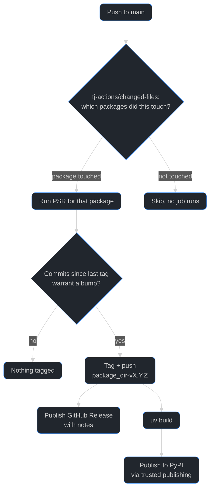

# Package versioning and publishing

Each package under [`packages/`](packages) (`overture_core`, `overture_serverless`, ...) is versioned and released independently, and fully automatically: there's no version to bump and no tag to create by hand.

## Background: python-semantic-release

This is the first use of [python-semantic-release](https://python-semantic-release.readthedocs.io/) (PSR) at Overture. It's the Python equivalent of the JS ecosystem's [`semantic-release`](https://semantic-release.gitbook.io/): both read a project's [Conventional Commits](https://www.conventionalcommits.org/) history and derive the next [SemVer](https://semver.org/) version from it (`fix:` → patch, `feat:` → minor, a `!`/`BREAKING CHANGE:` → major), instead of a human deciding and typing a version number. PSR then tags the release, generates release notes, and can build/publish the package, all from that one signal.

The distinguishing feature this repo relies on is PSR's `conventional-monorepo` commit parser: it understands a monorepo has more than one independently versioned package and can attribute a single commit to the specific package(s) it touched, by directory. That's what lets `overture_core` and `overture_serverless` each get tagged and released on their own schedule, off the same shared commit history, in the same workflow run.

## Version bump

There is no `version` field to edit. Each package's `pyproject.toml` declares `dynamic = ["version"]`; [`setuptools-scm`](https://setuptools-scm.readthedocs.io/) resolves the version from that package's latest `<package_dir>-v<version>` git tag at build time.

What you do control is the version *bump*, via Conventional Commits on your PR:

| Commit prefix                            | Bump  |
| ------------------------------------------ | ----- |
| `fix: ...`                                | patch |
| `feat: ...`                               | minor |
| `feat!: ...` / a `BREAKING CHANGE:` footer | major |

PSR attributes a commit to a package by which files it actually touched, not by a scope in the message: a plain `fix: ...` with no scope is fine, as long as the commit's diff falls under that package's directory. This means a single PR/commit that touches both packages correctly triggers an independent release for each.

### PR title = the commit PSR reads

This repo requires [Overture PR Checks (v2)](https://github.com/OvertureMaps/.github/blob/main/docs/pull-request-checks.md), which only accepts strict Conventional Commits titles (`type: description` / `type(scope): description`). Since PRs are squash-merged, GitHub's default squash-commit subject is the PR title verbatim, so the PR title has to be Conventional Commits for PSR to recognize it at all, but no particular scope is required.

## Release

On every push to `main`, [`publish_packages.yml`](.github/workflows/publish_packages.yml) first narrows to the packages actually touched by that push ([`tj-actions/changed-files`](https://github.com/tj-actions/changed-files), same discovery as [`test_python.yml`](.github/workflows/test_python.yml)), then runs PSR for each of those:

For each package, PSR looks at the commits since its last release tag and, if any warrant a bump, tags and pushes `<package_dir>-v<version>` (e.g. `overture_core-v0.2.0`): **no commit is ever made back to `main`**, and no `CHANGELOG.md` is committed to the repo. Release notes are published to the tag's [GitHub Release](https://docs.github.com/en/repositories/releasing-projects-on-github) instead, and the same job then builds with `uv build` (`setuptools-scm` picks up the version it just tagged) and publishes to PyPI via [trusted publishing](https://docs.pypi.org/trusted-publishers/), no stored credentials.

### Manual dispatch publishes to Test PyPI instead

Running `publish_packages.yml` manually (`workflow_dispatch`) never tags, releases, or touches real PyPI: it's a smoke test of the build/publish pipeline, not a release mechanism. Every package builds from its current (unreleased) state and publishes to [Test PyPI](https://test.pypi.org/) instead, through a separate `testpypi-<package_dir>` GitHub Environment (distinct from the `pypi-<package_dir>` one a push uses) so its trusted-publisher scoping never overlaps with a real release.

## Trusted publishing setup (one-time per package)

Each package publishes through its own GitHub Environment, named `pypi-<package_dir>` (e.g. `pypi-overture_core`) for real releases and `testpypi-<package_dir>` for manual-dispatch smoke tests, so PyPI's and Test PyPI's trusted-publisher configs can each scope access per package. `publish_packages.yml`'s `release` job references these as its `environment`, so GitHub auto-creates them the first time the job runs for a given package/trigger combination, no manual setup needed on the GitHub side. When adding a new package, the only manual steps are on PyPI and Test PyPI (each has its own separate account/project system, so both need this done independently):

1. Create the project (or use a "pending" trusted publisher to reserve the name on first publish, see [PyPI's docs](https://docs.pypi.org/trusted-publishers/creating-a-project-through-oidc/)) on both [pypi.org](https://pypi.org/manage/account/publishing/) and [test.pypi.org](https://test.pypi.org/manage/account/publishing/).
2. On pypi.org, add a trusted publisher: this repo, workflow `publish_packages.yml`, environment `pypi-<package_dir>`.
3. On test.pypi.org, add a trusted publisher: this repo, workflow `publish_packages.yml`, environment `testpypi-<package_dir>`.

## Adding a new package

Auto-discovered testable packages need no CI changes, see [`CONTRIBUTING.md`](CONTRIBUTING.md) for the `pyproject.toml` shape (`dynamic = ["version"]`, `[tool.setuptools_scm]`, `[tool.semantic_release]`) each package needs for this to work. Publishing does need the one-time trusted-publisher setup above, since PyPI has no auto-discovery of new projects.
