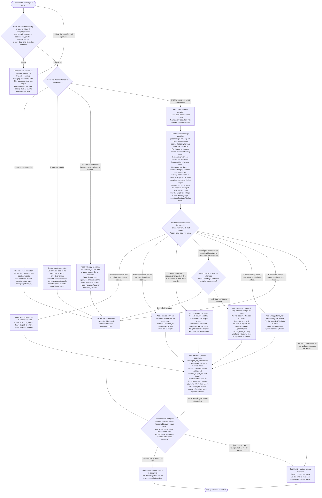
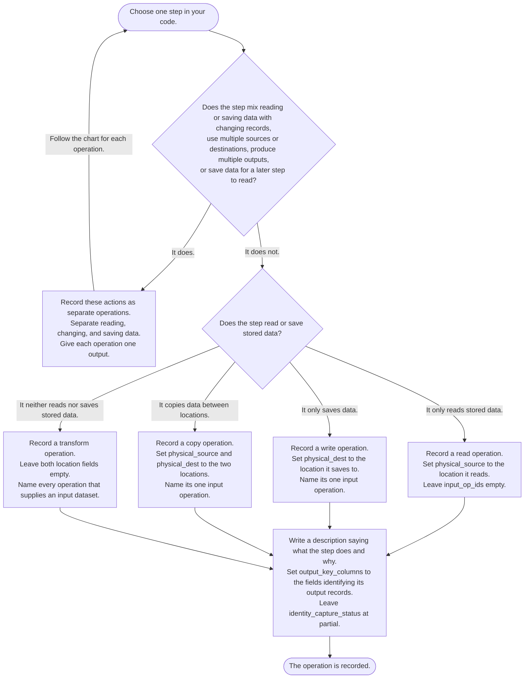

# How to record an operation

Start with one step in your code and follow the chart to see what to record.
A record is one item in a dataset, such as a building or a place. Its ID
identifies that item within the dataset. An input is a dataset the step uses,
and an output is the dataset it produces.

Give the step a description. Use `output_key_columns` to name the fields that
identify its output records. The [recording guide](./cairn_recording_guide.md)
explains the full rules for filling in the fields.

This chart shows every decision, and most of them will not reach you. Some are
already settled by the recording helpers: a write and a copy declare their own
pass-through, a transform with one input keyed like its output is treated as
passing records through unless you say otherwise, and `code_ref` and
`code_version` fill themselves in. Engine adapters are meant to take more of it,
so that a filter helper collects the rejected IDs and sets its own capture status
rather than asking you to. Read this chart to see what the fields mean and what is
being decided for you, rather than as a list of things to type at every call site.

If you only want dataset-level lineage to begin with, the
[operations-only chart](#operations-only-lineage) below is a shorter path that
skips the row detail table entirely.

When the chart tells you to leave a location or ID field empty, use `null`.
This means no value was supplied. Use `null` for an unspecified column list
too; an empty column list written as `[]` is not allowed. The lists of input
operations and pass-through inputs do allow `[]` when they have no members.

`input_op_id` identifies the operation that supplied an input record when the
step uses multiple inputs. Leave it empty when there is only one input or when
the entry records a newly created record with no input record.

Use `column_change` only on `content_changed` entries, and only if you want to
record how the value changed. Use `set` when an empty value was filled in,
`replaced` when an existing value changed, and `cleared` when a value became
empty.

Taking a value from another record does not require an extra `content_changed`
entry. Add one only if you also want to describe the before-and-after change.
Changing a record's ID does not require an extra `dropped` entry. Do not call a
record `minted` just because you do not know where it came from.

All branches that apply describe the same operation. Consider them together
before deciding whether every record is accounted for. A column list set to
`null` means no information about specific columns was recorded; it does not
mean all columns. Missing information about columns alone does not make the
record relationships incomplete.

## Operations-only lineage

A reasonable first pass is to record the operations table and write no row detail
at all. That answers "what steps built this dataset" and "which datasets fed
which," which is more than any single place in the pipeline says today, and it
needs no per-record work.

Everything here is a field on the operation. There are no entries to write, so
`identity_capture_status` stays `partial` on every transform: the recording says
which steps ran and what they consumed, and says nothing about what happened to
any individual record.

Three things are worth knowing about what this leaves on the table.

A reader can follow datasets but not records. Asking where one building went
returns nothing, because no entry mentions it and no operation claims complete
capture. That is the honest answer for a recording at this level, rather than a
gap in it.

Pass-through lists may fill themselves in, and that is harmless. A single-input
transform keyed like its output gets its input named without anyone asking, which
is a true statement that stays inert while capture is `partial`, since absence
only means survival under `complete`. It is also already correct if that operation
later starts writing entries.

Adding row detail later changes data and not schema. An operation that starts
writing entries sets its own capture status when it can account for every record,
and the operations already recorded keep their meaning. Nothing has to be
re-recorded, so starting here costs nothing except the answers you were not asking
for yet.
